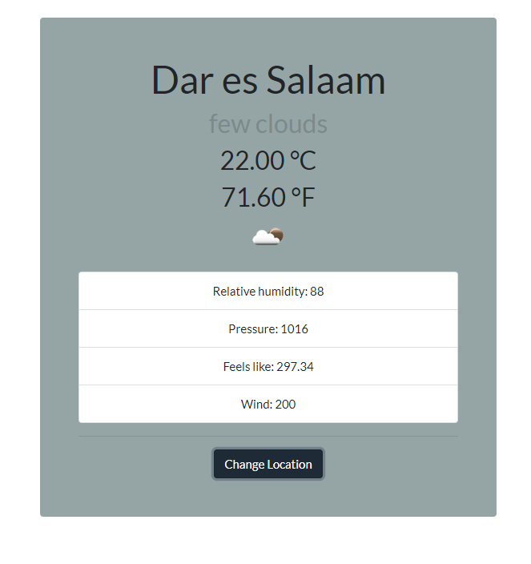

# Project: Weather App

 It`s an app for checking temperatures in different cities in the world. Weather details like actual city temperature in celcius are obtained using an API from Open Weather Map website.

## Built With

- HTML
- CSS
- Javascript
- Webpack
- Bootstrap 4

## Live Version

[Live Link](https://emmanuelkamala.github.io/WeatherApp/)

## Getting Started

Open your terminal or text editor and use next command

  git clone https://github.com/emmanuelkamala/weatherapp.git

  cd WeatherApp

  ### Run: 'npm install', to install all the dependencies

  ### Run: 'npm run dev', to compile the files, and start localserver

  ### visit: localhost:8080 on the browser

Happy coding! 

## Author

👤 **Author1**

- Github: [emmanuelkamala](https://github.com/emmanuelkamala)
- Twitter: [ejkamala](https://twitter.com/ejkamala)
- Linkedin: [emmanuelkamala](https://linkedin.com/in/emmanuelkamala)

## 🤝 Contributing

Contributions, issues and feature requests are welcome!

Feel free to check the [issues page](issues/).

## Show your support

Give a ⭐️ if you like this project!

## Acknowledgments

- The odin project
- Microverse tips
